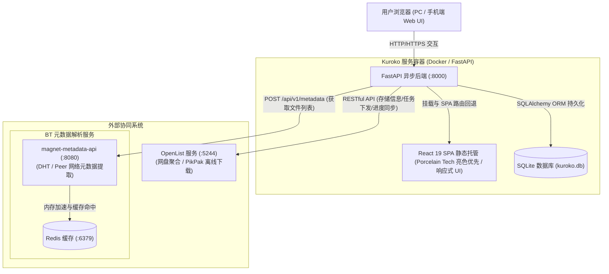
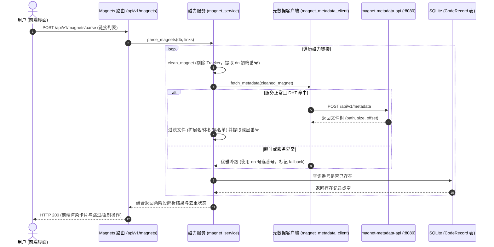
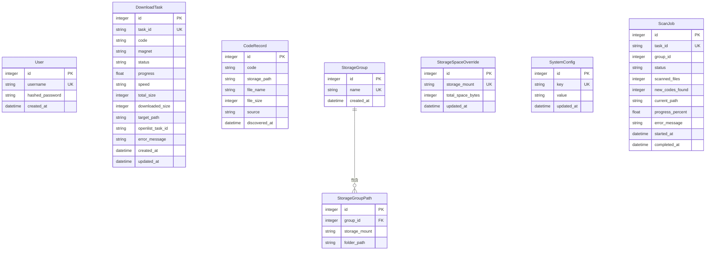

# Kuroko 架构设计

| 文档版本 | 状态 | 编写日期 | 适用系统版本 |
| :--- | :--- | :--- | :--- |
| v2.0.0 | 规划定稿 | 2026-09-11 | Kuroko v2.0+ |

---

## 1. 系统架构概览

Kuroko 是一套面向媒体番号资产管理、磁力链接清洗解析、离线下载智能调度与存储空间拓扑管理的现代化 Web 应用，采用前后端分离但支持单镜像整合部署的系统架构。

核心组件如下：
- **前端（Frontend SPA）**：基于 Vite + React 19 + TypeScript + Zustand + Shadcn/ui + Tailwind CSS (v4) 构建，贯彻 **Porcelain Tech（白瓷科技亮色优先）** 美术设计语言并全端响应式适配手机、平板与桌面。在生产环境中由 FastAPI 挂载的 SPA 静态中间件统一托管。
- **后端（Backend RESTful API）**：基于 FastAPI 构建的高性能异步接口服务，承担 JWT 鉴权、磁力链接清洗、两阶段番号识别、库内去重、Best-Fit 碎片空间优先调度算法及下载任务轮询同步。
- **持久层（Database）**：嵌入式 SQLite 搭配 SQLAlchemy 2.0 ORM，持久化用户、任务、番号记录、存储分组与系统配置。
- **外部协同服务**：
  - **OpenList 服务**：底层网盘聚合与文件管理抽象平台，作为 PikPak 离线下载的底层执行引擎。
  - **magnet-metadata-api**：独立部署的 Go 语言开源服务（基于 BitTorrent DHT/Peer 网络与 Redis 缓存），用于快速抓取磁力链接元数据与文件树。

### 1.1 系统架构拓扑图



---

## 2. 后端架构设计

### 2.1 目录结构与分层

```text
backend/app/
├── main.py                  # FastAPI 应用入口、全局异常捕获、CORS 与生命周期事件
├── serve.py                 # 生产启动入口 (python -m app.serve，自动准备目录与信号治理)
├── core/
│   ├── config.py            # 基础环境变量加载与默认项
│   ├── database.py          # SQLAlchemy 引擎、SessionLocal 依赖注入与 SQLite 连接池
│   ├── responses.py         # 统一 JSON 响应封装 (code, message, data)
│   ├── security.py          # JWT Token 签发/校验与密码哈希
│   └── spa.py               # 静态文件 SPA 路由回退中间件
├── api/
│   └── v1/
│       ├── router.py        # 路由聚合器
│       ├── auth.py          # 登录认证与 Token 刷新
│       ├── magnets.py       # 磁力解析、两阶段番号识别、批量提交
│       ├── tasks.py         # 任务监控列表、详情、取消与进度同步
│       ├── storages.py      # 存储挂载点拓扑、存储分组 CRUD、手动容量覆盖
│       ├── codes.py         # 番号资产分页查询、删除、定向扫描触发与状态
│       └── config.py        # 系统动态配置 CRUD、OpenList 与 BT 解析连通性测试
├── models/                  # SQLAlchemy 数据库实体
│   ├── user.py              # 用户表
│   ├── task.py              # 下载任务表 (DownloadTask)
│   ├── code.py              # 番号归档记录表 (CodeRecord)
│   ├── storage.py           # 存储分组及挂载路径表 (StorageGroup, StorageGroupPath, StorageSpaceOverride)
│   └── config.py            # 动态键值配置表与扫描任务表 (SystemConfig, ScanJob)
├── schemas/                 # Pydantic 强类型校验模型 (DTO)
│   ├── auth.py, magnet.py, task.py, storage.py, code.py, config.py, common.py
├── services/                # 领域核心业务逻辑层
│   ├── auth_service.py      # 用户鉴权与口令验证
│   ├── magnet_service.py    # 磁力解析控制编排、两阶段番号复核、文件过滤管道
│   ├── magnet_metadata_client.py # 对接 magnet-metadata-api 的标准适配器
│   ├── openlist_client.py   # OpenList API 客户端 (账号密码与 Token 双鉴权，自动重登)
│   ├── download_service.py  # 离线下载调度、去重拦截与强制下载通道
│   ├── storage_service.py   # 存储容量统计与 Best-Fit 碎片空间优先调度算法
│   ├── code_service.py      # 定向探测路径扫描、规则过滤与番号归档 (解耦独立)
│   └── config_service.py    # 动态系统配置读写与掩码脱敏
└── utils/
    ├── magnet_parser.py     # 磁力链接标准化与冗余 Tracker 净化工具
    └── code_extractor.py    # 番号通用正则匹配与格式归一化工具
```

### 2.2 核心服务协作流程

#### 磁力解析、复核与去重流转图


---

## 3. 前端架构与美术设计系统

### 3.1 技术栈与架构分层
- **技术选型**：React 19 + TypeScript + Vite + Zustand + Shadcn/ui + Tailwind CSS (v4) + Axios。
- **设计模式**：采用组件分层架构（`ui/` 原子组件、`common/` 复合组件、`features/` 领域组件、`layout/` 框架布局），通过 Zustand 实现单向数据流。

### 3.2 美术设计方案 (Porcelain Tech 亮色优先)
- **视觉风格**：现代高质感白瓷科技风（亮色优先，保留深色切换能力），底色采用温和的 `bg-slate-50`，卡片采用纯白 `bg-white` 配合精细微阴影 `shadow-sm shadow-slate-900/5` 与细腻边框 `border-slate-200/80`。
- **全端响应式体系 (Mobile-First)**：
  - 手机端：顶部紧凑 TopNav + 汉堡抽屉 Sheet 导航，按钮触控区 `>= 44px`；
  - 表格智能降级：任务列表与番号列表在移动端自适应折叠为垂直卡片流，杜绝横向滚动断裂；
  - 桌面端：常驻左侧 240px 侧边栏，大盘数据表格与双栏工作台。
- **色彩令牌体系 (Tokens)**：
  - 底色系统：底层温和微冷灰 (`#f8fafc`)、白瓷卡片色 (`#ffffff`)、悬停浮层色 (`#f1f5f9`)；
  - 高光与品牌：深邃群青蓝 (`#2563eb`)、天蓝高光 (`#0284c7`)；
  - 语义状态：就绪/成功绿 (`#059669`)、已存在/跳过金 (`#d97706`)、错误/已满红 (`#e11d48`)；
  - 数据等宽字体：番号、哈希、路径与容量统一使用 `JetBrains Mono`。
- **动态微交互**：
  - 输入框实时磁力 Tracker 净化微光提示动效；
  - 碎片空间优先（Best-Fit）算法推荐节点高光呼吸流；
  - 实时下载流动态进度条波纹。

---

## 4. 数据持久化模型 (ER 关系图)



---

## 5. 上游接入与任务边界

兼容基线为 **OpenList v4.2.6** 与 **magnet-metadata-api 0.1.0**。接口索引以 [OpenList llms.txt](https://fox.oplist.org/llms.txt) 为入口，任务状态与删除策略同时依据对应版本源码核对。

| 上游操作 | HTTP 接口 | 关键约定 |
| :--- | :--- | :--- |
| OpenList 登录 | `POST /api/auth/login` | 获取原始令牌；鉴权失效最多重登一次 |
| 验证权限 | `GET /api/me` | 存储管理需要管理员权限 |
| 存储列表 | `GET /api/admin/storage/list` | 使用真实 ID，完整分页，读取 `mount_details` |
| 原生容量回退 | `POST /api/fs/get` | 查询挂载根目录的 `mount_details` |
| 文件目录 | `POST /api/fs/list` | 完整分页；路径边界、大小、重复页与时间预算检查 |
| 离线工具 | `GET /api/public/offline_download_tools` | 检查目标路径能否使用 PikPak |
| 离线提交 | `POST /api/fs/add_offline_download` | `tool: PikPak`、`delete_policy: delete_always`；任务 ID 位于 `data.tasks[].id` |
| 离线/转存列表 | `GET /api/task/{kind}/undone`、`done` | `kind` 分别为 `offline_download` 与 `offline_download_transfer` |
| 单任务/取消 | `POST /api/task/{kind}/info`、`cancel` | `tid` 为查询参数 |
| 磁力元数据 | `POST /api/v1/metadata` | 请求 `magnet_uri`，响应顶层 `info_hash/name/size/files` |
| 元数据健康 | `GET /api/v1/health` | `status: ok` 和真实 `stats`，不推测 DHT 状态 |

OpenList 请求使用原始 `Authorization: <token>`，成功必须同时满足 HTTP 成功及业务 `code=200`。元数据服务没有内建认证；可选 Bearer token 仅用于外部认证代理。客户端复用连接并在使用结束后关闭，不把上游错误正文或存储 `addition` 中的凭据返回给前端。

下载提交先保存本地待处理记录，成功后逐条持久化上游任务 ID。指定目录直接使用；未指定时以完整种子大小做分组调度，保守预留尚在等待/下载的任务容量。网络中断或提交响应异常时保留待核实任务，不自动重新下发。容量是上游快照，不能保证其他客户端并发写入后的剩余空间。

后台同步在工作线程中创建并关闭数据库会话，不阻塞异步 API。OpenList 的数字状态以 tache v0.2.2 为准，取消中、重试中、等待重试等状态持续轮询。离线完成不表示独立转存完成；上游未提供公开的父子任务关联，因此转存列表独立展示，番号库只接受定向扫描发现的真实文件。

容量缺失时，先查询挂载根目录，手动配额再回退为当前挂载内完整统计。查询与统计有 30 秒共享预算；超过目录/文件上限、遇到独立子挂载或上游失败时返回 `space_error`，不使用部分扫描结果计算剩余空间。OneDrive 的原生容量开关、授权和请求延迟可能导致它与 GoogleDrive 表现不同。

## 6. 部署与协同编排

可执行配置以根目录 [docker-compose.yml](../../docker-compose.yml) 为准：Kuroko 整合前端静态文件，依赖元数据服务健康，元数据服务依赖 Redis 健康。

- 元数据镜像固定为 `felipemarinho97/magnet-metadata-api:0.1.0`，缓存显式设置为 `/app/cache` 并持久化。
- `CLIENT_PORT` 与宿主机 TCP/UDP 映射保持一致，默认 42069；健康检查使用 `/api/v1/health`。
- Redis 使用 AOF 与独立数据卷；不使用上游未支持的缓存 TTL 环境变量。
- Kuroko 使用 `KUROKO_BT_PARSER_SERVICE_URL` 配置容器内解析地址；数据库中的已保存配置优先于环境默认值。
- 本地验证执行 `docker compose config --quiet`；集成测试使用隔离数据库及 HTTP transport，不连接真实网盘。
