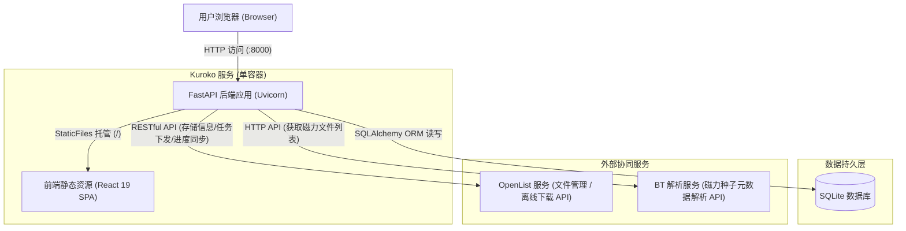
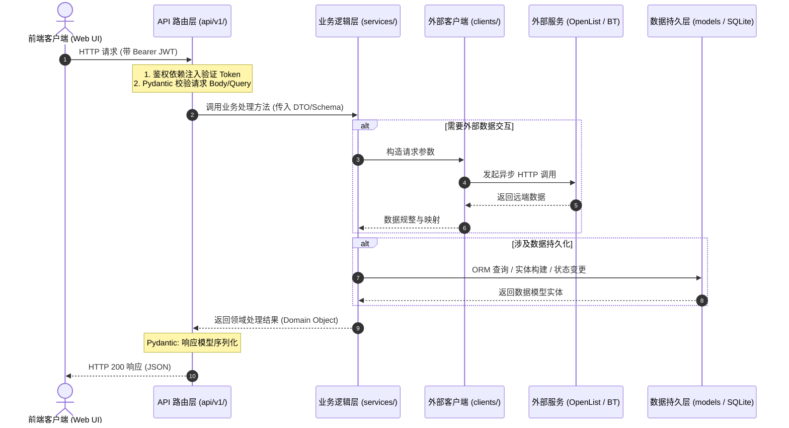
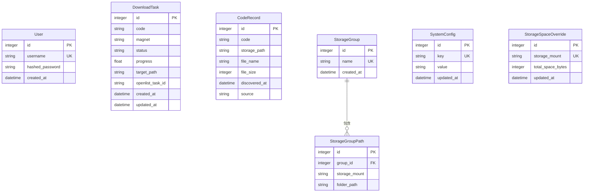
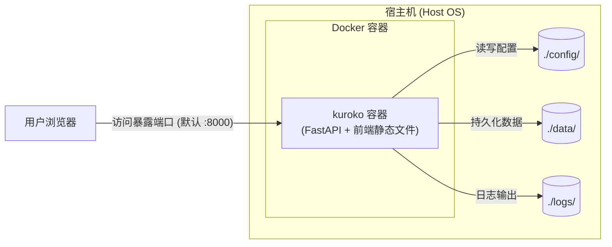

# Kuroko 架构设计

## 1. 系统架构概览

Kuroko 是一套面向媒体资源聚合解析、离线下载智能调度与存储空间规划管理的现代化 Web 应用，采用前后端分离架构设计。系统各核心组成如下：

- **前端（Frontend）**：基于 React 19 构建的单页应用（SPA），生产环境中由 FastAPI 的 `StaticFiles` 中间件提供静态文件托管，开发环境中由 Vite 开发服务器提供。
- **后端（Backend）**：基于 FastAPI 构建高性能异步 RESTful API，承担用户鉴权、磁力链接解析清洗、番号提取与去重、存储路径决策及下载任务调度。生产环境同时托管前端静态文件。
- **数据库（Database）**：采用 SQLite 作为主存储引擎，搭配 SQLAlchemy ORM，实现系统配置、番号记录、下载任务及存储分组配置的持久化，具备轻量、免运维与高可靠特性。
- **外部依赖（External Services）**：
  - **OpenList**：文件管理与存储抽象平台，Kuroko 通过其开放 RESTful API 接入多网盘存储，并作为离线下载的底层执行引擎。
  - **BT 解析服务**：第三方或独立部署的磁力元数据解析服务，负责根据磁力 Hash 获取种子内的完整文件列表、层级及体积信息。

### 1.1 系统架构图



---

## 2. 后端架构

### 2.1 目录结构

```
backend/
├── app/
│   ├── __init__.py
│   ├── main.py              # FastAPI 应用入口、中间件及全局异常处理
│   ├── serve.py             # 服务启动入口（python -m app.serve，支持目录准备与优雅停机）
│   ├── core/
│   │   ├── __init__.py
│   │   ├── config.py         # 应用配置（环境变量加载、默认值）
│   │   ├── spa.py            # 前端 SPA 静态文件托管与路由回退支持（参考 Amane 设计）
│   │   ├── security.py       # JWT 认证、密码哈希与加密算法
│   │   └── database.py       # SQLAlchemy 引擎配置与 Session 依赖注入
│   ├── api/
│   │   ├── __init__.py
│   │   └── v1/
│   │       ├── __init__.py
│   │       ├── router.py     # 路由聚合中心
│   │       ├── auth.py       # 用户认证与令牌颁发接口
│   │       ├── magnets.py    # 磁力链接解析、清洗与去重接口
│   │       ├── tasks.py      # 下载任务管理与进度追踪接口
│   │       ├── storages.py   # 存储挂载点与存储分组接口
│   │       ├── codes.py      # 番号数据归档与统计接口
│   │       └── config.py     # 系统设置与运行参数接口
│   ├── models/
│   │   ├── __init__.py
│   │   ├── user.py           # 用户数据表模型
│   │   ├── task.py           # 下载任务数据表模型
│   │   ├── code.py           # 番号统计与归档数据表模型
│   │   ├── storage_group.py  # 存储分组及关联路径模型
│   │   └── config.py         # 系统动态配置与容量覆盖模型
│   ├── schemas/
│   │   ├── __init__.py
│   │   ├── auth.py           # 认证请求/响应 Pydantic Schema
│   │   ├── magnet.py         # 磁力解析结果 Schema
│   │   ├── task.py           # 任务创建与详情 Schema
│   │   ├── storage.py        # 存储分组与挂载点 Schema
│   │   ├── code.py           # 番号查询与报表 Schema
│   │   └── config.py         # 系统参数配置 Schema
│   ├── services/
│   │   ├── __init__.py
│   │   ├── auth_service.py       # 用户认证与权限业务逻辑
│   │   ├── magnet_service.py     # 磁力链接解析、过滤核心逻辑
│   │   ├── openlist_client.py    # OpenList API 客户端封装
│   │   ├── bt_parser_client.py   # BT 解析服务客户端
│   │   ├── download_service.py   # 离线下载调度与存储分配策略
│   │   ├── code_service.py       # 番号统计与归档逻辑
│   │   └── storage_service.py    # 存储空间管理与容量计算逻辑
│   └── utils/
│       ├── __init__.py
│       ├── magnet_parser.py  # 磁力链接 URL 标准化与清洗工具
│       └── code_extractor.py # 番号正则匹配与文本提取工具
├── tests/
│   └── ...                   # 单元测试与集成测试套件
├── requirements.txt          # Python 依赖清单
└── pyproject.toml            # 项目元数据与工具链配置
```

### 2.2 分层设计

Kuroko 后端采用清晰的关注点分离（Separation of Concerns）三层架构：

- **API 层 (`api/v1/`)**：
  - 路由定义与请求分发；
  - 基于 FastAPI 依赖注入系统（Dependency Injection）处理 Token 认证与数据库 Session 会话管理；
  - 基于 Pydantic Schema 校验输入合法性并过滤序列化输出。
- **Service 层 (`services/`)**：
  - 系统核心业务逻辑的承载者；
  - 外部服务交互封装（OpenList Client、BT Parser Client）；
  - 包含磁力链接清洗、番号正则识别与去重、存储路径智能选择及下载进度同步。
- **Model 层 (`models/`)**：
  - 基于 SQLAlchemy Declarative 映射 SQLite 关系表结构；
  - 维持数据完整性、索引约束与持久化。

#### 请求处理流程图



### 2.3 核心服务设计

#### OpenList Client
- **定位**：对 OpenList RESTful API 的完整异步封装客户端。
- **认证方式**：
  - **账号密码登录**：调用 `/api/auth/login` 动态获取 JWT Token，在内存中管理 Token 状态与自动重试；
  - **Token 直连**：支持直接配置长效 API 令牌，适配微服务免登调用。
- **主要方法**：
  - `login()`：执行账号密码登录并换取访问凭证；
  - `list_files(path: str)`：列举指定挂载路径下的目录与文件元数据；
  - `get_storage_info()`：获取全部挂载存储的可用容量、已用空间与存储池配置；
  - `add_offline_download(urls: list[str], save_path: str)`：向 OpenList 提交离线下载任务；
  - `get_offline_tasks(task_ids: list[str] = None)`：轮询离线下载进度、速度及当前状态（等待、下载中、完成、失败）。

#### Magnet Service
- **磁力链接清理**：标准化 Magnet URI，剔除冗余 Tracker（`&tr=`）及展示参数，仅保留核心 `magnet:?xt=urn:btih:<hash>` 标识。
- **番号提取**：基于正则匹配规则库（兼容大写字母数字标准格式、无连字符格式及特殊厂商前缀），自动从种子名或文件树中提取标准化番号。
- **文件列表过滤**：
  - 后缀过滤：匹配白名单扩展名（如 `.mp4`、`.mkv`、`.ts` 等视频格式），剔除垃圾小文件；
  - 体积过滤：按预设体积下限过滤广告样片与宣传片段；
  - 黑名单过滤：根据关键词排除推广文件和夹带广告。
- **番号去重检查**：在任务下发前，查询本地 `CodeRecord` 历史库，标记是否已存在归档，避免重复下载占用存储空间。

#### Download Service
- **智能选择下载目标路径**：
  - 用户选定目标“存储分组”后，服务拉取该分组绑定的所有存储挂载路径；
  - 结合实时容量与手动覆盖配额，计算每个路径对应存储的剩余空间；
  - 默认执行**分组内空间最少优先**策略（即优先使用已用空间最少或剩余容量最充裕的存储挂载点）。
- **空间不足自动顺延**：预估下载任务所需总空间，若当前最优目标路径空间不足，策略引擎自动回退顺延至分组内次优路径；全组空间不足时拦截下发并给出告警提示。
- **下载进度同步**：后台任务定期轮询 OpenList 任务状态，双向同步本地 `DownloadTask` 的状态（Pending -> Downloading -> Completed / Failed）与下载百分比。
- **下载完成后番号入库**：检测到任务完成事件后，触发入库流程，解析最终落盘文件并记录 `CodeRecord` 归档。

---

## 3. 前端架构

### 3.1 技术选型

- **核心框架**：React 19 + TypeScript
- **包管理器与构建工具**：pnpm 10+ 与 Vite（高效硬链接依赖管理与快速模块热替换）
- **组件库**：Shadcn/ui（基于 Radix UI + Tailwind CSS，现代简约且高可定制）
- **状态管理**：Zustand（轻量级、无样板代码的全局与会话状态管理）
- **数据获取与缓存**：TanStack Query（React Query，负责服务端数据拉取、自动重新验证、后台轮询与缓存）
- **HTTP 客户端**：Axios（统一请求/响应拦截器、JWT 注入与 401 登出重定向）

### 3.2 目录结构

```
frontend/
├── src/
│   ├── main.tsx              # 应用挂载入口
│   ├── App.tsx               # 路由定义与全局 Context/Provider 容器
│   ├── api/                  # API 请求封装
│   │   ├── client.ts         # Axios 实例及拦截器配置
│   │   ├── auth.ts           # 用户登录与登出 API
│   │   ├── magnets.ts        # 磁力解析与清洗 API
│   │   ├── tasks.ts          # 离线任务管理与轮询 API
│   │   ├── storages.ts       # 存储分组与挂载点 API
│   │   ├── codes.ts          # 番号归档与检索 API
│   │   └── config.ts         # 系统全局配置 API
│   ├── components/           # 通用业务与展示组件
│   │   └── ui/               # Shadcn 基础 UI 组件 (Button, Dialog, Table, Form 等)
│   ├── pages/                # 页面组件
│   │   ├── Login.tsx         # 登录页
│   │   ├── Dashboard.tsx     # 总览面板
│   │   ├── MagnetParser.tsx  # 磁力解析页
│   │   ├── Tasks.tsx         # 下载任务页
│   │   ├── Codes.tsx         # 番号统计页
│   │   ├── Storages.tsx      # 存储管理页
│   │   └── Settings.tsx      # 系统设置页
│   ├── stores/               # Zustand 状态容器
│   │   ├── auth.ts           # 鉴权 Token 与用户会话状态
│   │   └── ui.ts             # 界面主题与侧边栏折叠状态
│   ├── hooks/                # 业务自定义 Hooks
│   ├── lib/                  # 公用工具函数 (formatters, cn 等)
│   └── types/                # TypeScript 接口与类型定义
├── index.html                # SPA 单页 HTML 入口
├── vite.config.ts            # Vite 构建配置文件
├── tsconfig.json             # TypeScript 配置
├── tailwind.config.ts        # Tailwind CSS 样式配置
└── package.json              # 依赖清单与构建脚本
```

### 3.3 页面设计概述

- **Login.tsx（登录页）**：提供用户登录入口，进行 JWT 鉴权与本地会话持久化，处理令牌过期后的智能跳转。
- **Dashboard.tsx（总览面板）**：集中呈现系统运行大盘，包含正在下载任务数、已完成总量、番号收录总数、各存储挂载点剩余容量图表，以及近期任务动态。
- **MagnetParser.tsx（磁力解析页）**：核心操作工作台。支持批量粘贴多行磁力链接，调用后端 BT 解析并自动提取番号；展示清洗后结果、文件列表树与文件体积；高亮显示已入库番号并防重；支持选择存储分组并一键下发离线下载。
- **Tasks.tsx（下载任务页）**：下载任务集中监控中心。列表展示任务状态（等待、下载中、完成、失败）、实时传输进度条、目标挂载路径；支持手动刷新、重试、取消任务。
- **Codes.tsx（番号统计页）**：番号数据资产管理与检索台。支持按番号精确或模糊搜索、按来源（本地扫描入库 / 离线下载入库）过滤、按归档时间排序，并提供重复番号文件排查功能。
- **Storages.tsx（存储管理页）**：多存储与分组编排。可视化各挂载点空间占用，支持维护“存储分组”与关联路径；支持针对特殊存储源配置“空间容量手动覆盖”。
- **Settings.tsx（系统设置页）**：全局参数配置中心。维护 OpenList 连接凭据与地址、BT 解析服务地址、番号提取正则调优、文件后缀与黑名单过滤规则、系统安全密码修改。

---

## 4. 数据模型

核心数据模型通过 SQLAlchemy ORM 映射至 SQLite 数据库中。

### 4.1 实体关系图 (Mermaid ER 图)



### 4.2 实体说明

| 实体模型 | 数据表职责与主要字段 |
| :--- | :--- |
| **User** | 系统管理员/操作员用户表：`id`, `username`, `hashed_password`, `created_at` |
| **DownloadTask** | 离线下载任务记录表：`id`, `code` (番号), `magnet` (磁力链接), `status` (PENDING/DOWNLOADING/COMPLETED/FAILED), `progress` (进度 0.0~1.0), `target_path` (下载目标路径), `openlist_task_id` (OpenList 任务 ID), `created_at`, `updated_at` |
| **CodeRecord** | 番号归档记录表：`id`, `code` (标准番号), `storage_path` (挂载根路径), `file_name` (存储文件名), `file_size` (文件字节大小), `discovered_at` (入库时间), `source` (来源，如 `scan` 扫描发现或 `download` 任务下载) |
| **StorageGroup** | 存储逻辑分组表：`id`, `name` (分组名称), `created_at` |
| **StorageGroupPath** | 存储分组挂载子路径映射表：`id`, `group_id` (关联分组 ID), `storage_mount` (OpenList 挂载点名), `folder_path` (挂载下子目录路径) |
| **SystemConfig** | 系统键值对动态配置表：`id`, `key` (唯一配置项名称), `value` (JSON 或配置字符串), `updated_at` |
| **StorageSpaceOverride**| 存储容量手动覆盖表：`id`, `storage_mount` (挂载点名), `total_space_bytes` (手动指定的总空间字节数), `updated_at` |

---

## 5. 部署架构

Kuroko 采用**前后端合一单镜像**部署，前端构建产物并入 FastAPI 作为静态文件提供，无需独立 Nginx 容器。



### 5.1 镜像构建与容器设计

1. **多阶段 Dockerfile**（项目根目录）：
   - 阶段 1：Node 22 + pnpm 构建前端 → 生成 `dist/` 静态产物；
   - 阶段 2：Python 3.12-slim 安装后端依赖，将前端产物复制到 `/app/static`，通过 `mount_spa` 中间件与 FastAPI 深度集成。
2. **启动命令规范**：
   - 容器 CMD 采用 `python -m app.serve`（参考 Amane 实践），启动时自动完成 `config/`、`data/`、`logs/` 目录权限与生命周期检查，并编排 Uvicorn 优雅停机。
3. **持久化与日志挂载目录**：
   - `config/`：系统持久化配置文件目录；
   - `data/`：应用运行时数据（SQLite 数据库等）；
   - `logs/`：系统运行与审计日志。
4. **端口**：仅暴露一个后端服务端口（默认 `8000`），通过 `BACKEND_PORT` 环境变量灵活指定。

### 5.2 部署文件示例

#### docker-compose.yml
```yaml
services:
  kuroko:
    image: ghcr.io/<owner>/kuroko:latest
    container_name: kuroko
    restart: unless-stopped
    ports:
      - "${BACKEND_PORT:-8000}:8000"
    volumes:
      - ./config:/app/config
      - ./data:/app/data
      - ./logs:/app/logs
    environment:
      - KUROKO_SECRET_KEY=${KUROKO_SECRET_KEY:-change-me-in-production}
```

