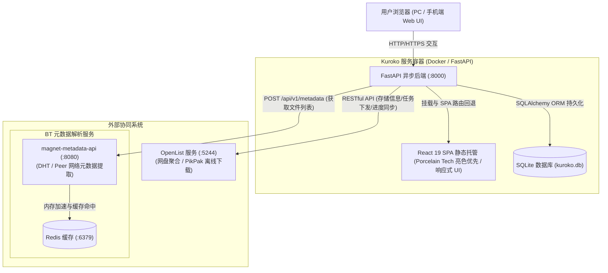
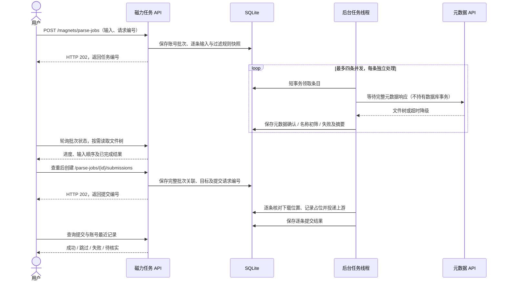
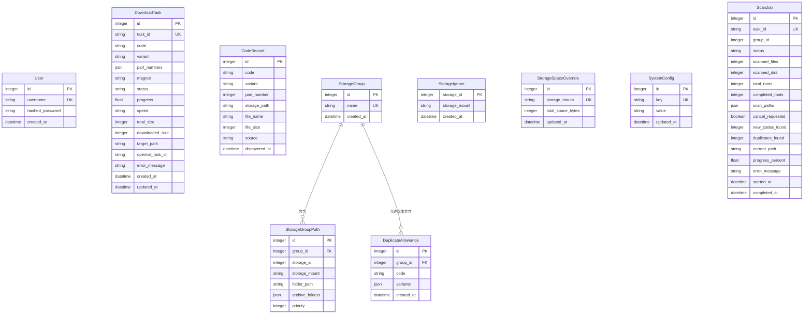

# Kuroko 架构设计

| 文档版本 | 状态 | 编写日期 | 适用系统版本 |
| :--- | :--- | :--- | :--- |
| v2.0.0 | 规划定稿 | 2026-09-11 | Kuroko 0.5+ |

---

## 1. 系统架构概览

Kuroko 是一套面向媒体番号资产管理、磁力链接清洗解析、离线下载智能调度与存储空间拓扑管理的现代化 Web 应用，采用前后端分离但支持单镜像整合部署的系统架构。

核心组件如下：
- **前端（Frontend SPA）**：基于 Vite + React 19 + TypeScript + Zustand + Shadcn/ui + Tailwind CSS (v4) 构建，使用 neutral 语义主题并全端响应式适配手机、平板与桌面。在生产环境中由 FastAPI 挂载的 SPA 静态中间件统一托管。
- **后端（Backend RESTful API）**：基于 FastAPI 构建的高性能异步接口服务，承担 JWT 鉴权、磁力链接清洗、两阶段番号识别、库内去重、Best-Fit 碎片空间优先调度算法及下载任务轮询同步。
- **持久层（Database）**：嵌入式 SQLite 搭配 SQLAlchemy 2.0 ORM，持久化用户、任务、番号记录、存储分组与系统配置。
- **外部协同服务**：
  - **OpenList 服务**：底层网盘聚合与文件管理抽象平台，作为 PikPak 离线下载的底层执行引擎。
  - **magnet-metadata-api**：独立部署的 Go 语言开源服务（基于 BitTorrent DHT/Peer 网络与 Redis 缓存），用于快速抓取磁力链接元数据与文件树。

### 1.1 系统架构拓扑图



---

## 2. 后端架构设计

### 2.1 目录结构与分层

```text
backend/app/
├── main.py                  # FastAPI 应用入口、全局异常捕获、CORS 与生命周期事件
├── serve.py                 # 生产启动入口 (python -m app.serve，自动准备目录与信号治理)
├── core/
│   ├── config.py            # 基础环境变量加载与默认项
│   ├── database.py          # SQLAlchemy 引擎、会话与启动时 Alembic 升级
│   ├── responses.py         # 统一 JSON 响应封装 (code, message, data)
│   ├── security.py          # JWT Token 签发/校验与密码哈希
│   └── spa.py               # 静态文件 SPA 路由回退中间件
├── api/
│   └── v1/
│       ├── router.py        # 路由聚合器
│       ├── auth.py          # 登录认证与 Token 刷新
│       ├── magnets.py       # 磁力解析、两阶段番号识别、批量提交
│       ├── tasks.py         # 任务监控列表、详情、取消与进度同步
│       ├── storages.py      # 存储挂载点拓扑、存储分组 CRUD、手动容量覆盖
│       ├── codes.py         # 番号资产分页查询、删除、定向扫描触发与状态
│       └── config.py        # 系统动态配置 CRUD、OpenList 与 BT 解析连通性测试
├── models/                  # SQLAlchemy 数据库实体
│   ├── user.py              # 用户表
│   ├── task.py              # 下载任务表 (DownloadTask)
│   ├── code.py              # 番号记录与分组版本放行规则 (CodeRecord, DuplicateAllowance)
│   ├── storage.py           # 分组成员、目录、容量覆盖和节点忽略项
│   └── config.py            # 动态键值配置表与扫描任务表 (SystemConfig, ScanJob)
├── schemas/                 # Pydantic 强类型校验模型 (DTO)
│   ├── auth.py, magnet.py, task.py, storage.py, code.py, config.py, common.py
├── services/                # 领域核心业务逻辑层
│   ├── auth_service.py      # 用户鉴权与口令验证
│   ├── magnet_service.py    # 磁力解析控制编排、两阶段番号复核、文件过滤管道
│   ├── magnet_metadata_client.py # 对接 magnet-metadata-api 的标准适配器
│   ├── openlist_client.py   # OpenList API 客户端 (账号密码与 Token 双鉴权，自动重登)
│   ├── download_service.py  # 离线下载调度、去重拦截与强制下载通道
│   ├── storage_service.py   # 存储容量统计与 Best-Fit 碎片空间优先调度算法
│   ├── code_service.py      # 定向探测路径扫描、规则过滤与番号归档 (解耦独立)
│   ├── library_service.py   # 目录归属、组内跨盘查重与版本放行，解析/提交/扫描共用
│   ├── read_cache.py        # 有界 TTL 读取缓存与并发请求合并
│   └── config_service.py    # 动态系统配置读写与掩码脱敏
└── utils/
    ├── magnet_parser.py     # 磁力链接标准化与冗余 Tracker 净化工具
    └── code_extractor.py    # 番号通用正则匹配与格式归一化工具
```

### 2.2 核心服务协作流程

#### 磁力解析、复核与去重流转图



`magnet_jobs` 负责工作台的持久化流程，`magnet_service.build_parse_result` 复用原有过滤和番号识别规则；同步 `/magnets/parse` 与 `/magnets/batch-download` 保留兼容。提交仍由现有下载服务核实元数据、查重和验证目标，不信任浏览器传入的大小。

---

## 3. 前端架构与美术设计系统

### 3.1 技术栈与架构分层
- **技术选型**：React 19 + TypeScript + Vite + Zustand + Shadcn/ui + Tailwind CSS (v4) + Axios。
- **设计模式**：采用组件分层架构（`ui/` 原子组件、`common/` 复合组件、`features/` 领域组件、`layout/` 框架布局），通过 Zustand 实现单向数据流。

前端会话协调器保存访问与刷新令牌，临近过期和 401 共用一次刷新；短暂网络错误不注销。账号切换递增会话版本，迟到响应不覆盖当前状态。旧版仅保存访问令牌的会话需要重新登录一次补齐刷新凭证。

磁力草稿用独立的 Zustand store＋`localStorage` 按用户 ID 保存，包含输入修订号、关联条目索引及尚未确认的创建请求编号。每次输入即时保存，提交完成只移出同一修订草稿中的成功项；恢复历史先保存可撤销备份。账号变化只清内存，磁力草稿与存储展示缓存的清理相互独立。全局磁力任务跟踪不依赖页面挂载，运行时每两秒查询，失败退避到最多 30 秒。

### 3.2 界面组件与主题
- **组件来源**：使用 shadcn CLI 的 `default` 组件，保留状态徽章与进度条指示器的必要扩展；表单使用 `Label`、`Checkbox`、`RadioGroup`，原生下拉框保留移动端系统选择器并共用语义样式。
- **主题管理**：neutral 亮暗色定义集中在 `frontend/src/styles/globals.css`。`ThemeProvider` 支持 `light/dark/system`，偏好保存在 `kuroko-theme`，监听系统偏好和跨标签页变化；`index.html` 在应用加载前预设主题，避免首屏闪烁。通知由应用根节点的 Sonner 统一展示，覆盖登录与初始化流程。
- **全端响应式体系 (Mobile-First)**：
  - 手机端：顶部紧凑 TopNav + 汉堡抽屉 Sheet 导航，按钮触控区 `>= 44px`；
  - 表格智能降级：任务列表与番号列表在移动端自适应折叠为垂直卡片流，杜绝横向滚动断裂；
  - 桌面端：常驻左侧 240px 侧边栏，大盘数据表格与双栏工作台。
- **色彩令牌体系 (Tokens)**：
  - 底色与文字使用 `background/foreground`、`card/card-foreground`、`popover/popover-foreground`，边框与焦点使用 `border/input/ring`；
  - 品牌与交互使用 `primary`、`accent`、`muted`，由主题决定实际颜色；
  - 业务状态保留 `success/warning/info/destructive` 语义色，在亮暗主题中分别定义可读色值；
  - 数据等宽字体：番号、哈希、路径与容量统一使用 `JetBrains Mono`。
- **动态微交互**：
  - 输入框实时磁力 Tracker 净化微光提示动效；
  - 碎片空间优先（Best-Fit）算法推荐节点高光呼吸流；
  - 实时下载流动态进度条波纹。

---

## 4. 数据持久化模型 (ER 关系图)



`StorageGroupPath` 保留旧表名与相对下载目录 `folder_path`，增加真实 `storage_id`、相对归档目录列表 `archive_folders` 及成员级 `priority`；API 的 `members` 使用完整绝对路径。节点可加入多组，番号文件仅保存一份物理路径记录，按配置目录动态判断所属分组，避免目录调整或多组共享时产生重复索引。

番号与版本分开保存，FC2 的可选 PPV 前缀不参与身份区分。版本放行规则按分组和番号保存版本集合，不绑定文件路径；普通番号按集合内不同版本各一份放行；FC2 则按每个版本的每一分集各一份放行。FC2 文件的 `part_number` 把无后缀基础文件记为 0，括号、数字、CD 和 part 后缀归一为数字；活动下载的 `part_numbers` 保存完整分集集合，历史任务或元数据不明时保持 null 并保守检查。同集重复、未批准版本组合及活动任务冲突仍参与拦截。直接选择未分组目录时采用目录范围查重，前端明确显示该范围。

启动通过 Alembic 升级到最新结构；完整的旧 `create_all` 数据库在无版本记录时自动标记 `0001_initial` 基线，包含版本表已存在但为空的情况。升级逐项检查已有表、列和索引，兼容旧进程提前创建新表或迁移部分执行的混合结构。SQLite 显式事务覆盖建表与数据变更，升级失败可整体回滚。`0002_library_scopes` 保留原下载目录，合并同分组同挂载的旧探测目录，归一化 FC2 与旧任务磁力的 URN，并建立忽略项、版本放行表及关键查询索引。旧成员无法离线推断真实存储 ID，暂存 null，界面按挂载匹配后在保存时绑定。`0003_storage_jobs_parts` 为旧成员补默认优先级 0，增加扫描范围快照、取消和目录进度字段，从已有 FC2 文件名回填分集，不改动真实媒体文件或撤销已有放行规则。旧客户端保存目录不会清空已有优先级。

---

`0004_magnet_jobs` 新增 `magnet_parse_jobs`、`magnet_parse_items`、`magnet_submissions`、`magnet_submission_items`。按账号和请求编号唯一约束创建任务，请求内容不一致返回冲突；逐条保存原索引、结果及下载任务关联。状态摘要与完整文件树分开读取，最近记录分页返回，不自动清理已保存批次。

服务生命周期管理四个解析线程和一个提交线程，沿用单进程部署约定。启动时把中断的解析条目重新排队，已停止的批次不自动继续；提交条目若已有上游任务编号则恢复成功，明确失败则恢复失败，其余正在提交的条目标记待核实，尚未开始的条目继续处理。下载占位和历史关联在同一事务保存；代次与运行标识阻止旧执行结果覆盖恢复后的状态。

## 5. 上游接入与任务边界

兼容基线为 **OpenList v4.2.6** 与 **magnet-metadata-api 0.1.0**。接口索引以 [OpenList llms.txt](https://fox.oplist.org/llms.txt) 为入口，任务状态与删除策略同时依据对应版本源码核对。

| 上游操作 | HTTP 接口 | 关键约定 |
| :--- | :--- | :--- |
| OpenList 登录 | `POST /api/auth/login` | 获取原始令牌；鉴权失效最多重登一次 |
| 验证权限 | `GET /api/me` | 存储管理需要管理员权限 |
| 存储列表 | `GET /api/admin/storage/list` | 使用真实 ID，完整分页，读取 `mount_details` |
| 原生容量回退 | `POST /api/fs/get` | 查询挂载根目录的 `mount_details` |
| 文件目录 | `POST /api/fs/list` | 完整分页；路径边界、大小、重复页与时间预算检查 |
| 离线工具 | `GET /api/public/offline_download_tools` | 检查目标路径能否使用 PikPak |
| 离线提交 | `POST /api/fs/add_offline_download` | `tool: PikPak`、`delete_policy: delete_always`；任务 ID 位于 `data.tasks[].id` |
| 离线/转存列表 | `GET /api/task/{kind}/undone`、`done` | `kind` 分别为 `offline_download` 与 `offline_download_transfer` |
| 单任务/取消 | `POST /api/task/{kind}/info`、`cancel` | `tid` 为查询参数 |
| 磁力元数据 | `POST /api/v1/metadata` | 请求 `magnet_uri`，响应顶层 `info_hash/name/size/files` |
| 元数据健康 | `GET /api/v1/health` | `status: ok` 和真实 `stats`，不推测 DHT 状态 |

OpenList 请求使用原始 `Authorization: <token>`，成功必须同时满足 HTTP 成功及业务 `code=200`。元数据服务没有内建认证；可选 Bearer token 仅用于外部认证代理。客户端复用连接并在使用结束后关闭，不把上游错误正文或存储 `addition` 中的凭据返回给前端。

下载提交先保存本地待处理记录，成功后逐条持久化上游任务 ID。指定目录直接使用；未指定时以完整种子大小做分组调度，保守预留尚在等待/下载的任务容量。容量与状态满足要求的成员按优先级降序、剩余空间升序选择，空间不足则顺延。网络中断或提交响应异常时保留待核实任务，不自动重新下发。容量是上游快照，不能保证其他客户端并发写入后的剩余空间。

解析和上游提交始终输出未编码冒号的 `magnet:?xt=urn:btih:…`，显示名单独编码。下载提交在进程内串行完成查重与任务占位，防止并发请求同时通过检查；强制下载也不能绕过节点忽略和同磁力同目录待处理任务检查。

OpenList 读取缓存以连接配置摘要隔离，最多保存 256 项：存储、容量与离线工具缓存 30 秒，目录与文件信息 15 秒，登录令牌 600 秒。同键并发读取合并，失败不缓存，超过 2000 项的列表不驻留缓存。主动刷新跳过缓存，配额或忽略项变更清空缓存；扫描使用新目录结果。缓存及扫描、提交锁的范围均为单个服务进程。

展示层使用 Zustand＋`sessionStorage` 保存节点、分组和忽略项的成功快照，附带版本和更新时间；与后端调度缓存分开。`storage_events` 为数据源生成随机标识，并在配置变化和任务终态递增版本，通过 `/storages/revision` 供全局每 10 秒轻量查询。后台轮询同时观察独立转存任务；只保存固定长度终态摘要，重复读取不重复刷新，历史终态集合变化也可触发失效。源切换、登出、旧响应和失败结果均有隔离处理；浏览器刷新可复用同源快照，手动刷新强制读取上游。

扫描读取各分组的下载和归档目录，合并相同挂载内重叠范围；独立子挂载须另行配置。扫描在创建时保存路径快照，不设总时限，保留单次请求超时及单根 5000 个目录、100000 个条目的上限。每批 100 个文件、处理满 2 秒或进入下一目录／分页前提交进度，并检查取消标记。网络等待不持有 SQLite 写事务，可同时查询状态和请求取消；仅在完整根扫描成功后清理失效索引。取消、失败或忽略节点时保留未完成范围的旧记录。前端全局独立跟踪扫描状态，运行时每 2 秒读取，短暂失败退避重试，不受容量刷新等待影响。

后台同步在工作线程中创建并关闭数据库会话，不阻塞异步 API。OpenList 的数字状态以 tache v0.2.2 为准，取消中、重试中、等待重试等状态持续轮询。离线完成不表示独立转存完成；上游未提供公开的父子任务关联，因此转存列表独立展示，番号库只接受定向扫描发现的真实文件。

容量缺失时，先查询挂载根目录，手动配额再回退为当前挂载内完整统计。查询与统计有 30 秒共享预算；超过目录/文件上限、遇到独立子挂载或上游失败时返回 `space_error`，不使用部分扫描结果计算剩余空间。OneDrive 的原生容量开关、授权和请求延迟可能导致它与 GoogleDrive 表现不同。删除手动配额后立即恢复原生查询；容量失败不回滚已删除的覆盖值，界面显示自动模式、未知容量及原因。

番号列表的 `total` 继续用于文件分页，`total_codes` 为同一分组／搜索范围的去重数量。查重文件按组匹配下载／归档根路径并返回用途标签，目录重叠取最长匹配，同根双用途同时保留。

## 6. 部署与协同编排

前后端版本优先使用构建参数／环境变量 `KUROKO_VERSION`，本地源码其次读取当前提交可追溯的 Git tag，最后回退到项目元数据。发布工作流把同一 tag 传入 Docker 的前端构建阶段和后端运行阶段，界面、健康检查及 OpenAPI 均去掉 `v` 前缀；版本必须为不超过 128 字符的有效语义化版本。

可执行配置以根目录 [docker-compose.yml](../../docker-compose.yml) 为准：Kuroko 整合前端静态文件，依赖元数据服务健康，元数据服务依赖 Redis 健康。

- 元数据镜像固定为 `felipemarinho97/magnet-metadata-api:0.1.0`，缓存显式设置为 `/app/cache` 并持久化。
- `CLIENT_PORT` 与宿主机 TCP/UDP 映射保持一致，默认 42069；健康检查使用 `/api/v1/health`。
- Redis 使用 AOF 与独立数据卷；不使用上游未支持的缓存 TTL 环境变量。
- Kuroko 使用 `KUROKO_BT_PARSER_SERVICE_URL` 配置容器内解析地址；数据库中的已保存配置优先于环境默认值。
- 本地验证执行 `docker compose config --quiet`；集成测试使用隔离数据库及 HTTP transport，不连接真实网盘。
