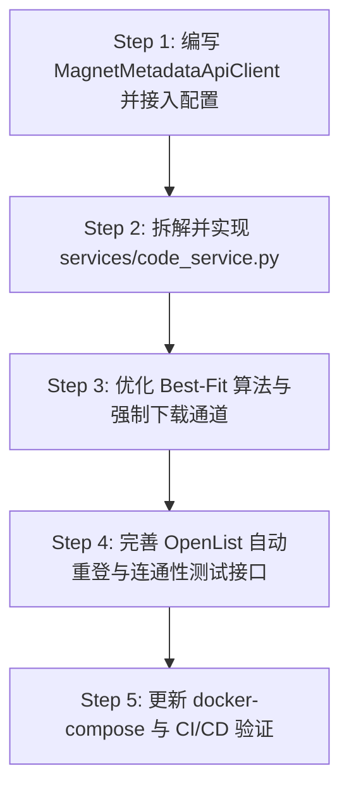

# Kuroko 后端查漏补缺与 magnet-metadata-api 集成计划 (Backend Enhancement Plan)

> **文档状态**：规划定稿  
> **适用版本**：Kuroko 2.0+ 后端架构  
> **服务技术栈**：FastAPI + SQLAlchemy 2.0 + SQLite + Pydantic v2 + Uvicorn + HTTPX  

---

## 1. 后端 12 条需求全面审查与缺漏清单 (Audit & Gap Analysis)

对照系统核心需求规格，对当前后端代码实现进行逐项深度审查：

| 需求编号 | 需求要点 | 现有实现状态 | 发现的缺漏与改进点 |
| :--- | :--- | :--- | :--- |
| **FR-01** | JWT 认证系统，多项敏感数据保护 | 部分实现 | 缺少 Token 刷新路由防御性设计；日志与异常中对 OpenList Token/BT 凭证的掩码脱敏需要强制收敛。 |
| **FR-02** | 磁力链接清洗、两阶段番号提取、文件过滤 | 基础实现，接口虚构 | **核心缺漏**：原 `BtParserClient` 对接虚构的 `/parse`，必须全面重写以对接 **`felipemarinho97/magnet-metadata-api`**；番号提取正则过于单薄（仅支持 `[A-Z]{2,5}-\d{3,5}`），需兼容 `T28`、`FC2`、无横线等；需支持前端与后端双重 Tracker 净化。 |
| **FR-03** | 番号库内比对去重、拦截与跳过 | 部分实现 | 接口已返回 `exists_in_library`，但缺少被跳过任务的专门查询和展示模型，缺少强制下载历史追踪。 |
| **FR-04** | OpenList 文件获取与分库空间统计 | 基础实现 | 空间计算存在驱动兼容性问题；在递归计算已用大小时缺少并发频控保护，可能引发 OpenList 502/限流。 |
| **FR-05** | 离线下载绑定 PikPak 与总是删除 | 已满足契约 | 固定参数为 `tool: "pikpak"`, `delete_policy: "always"`；需增强向 OpenList 下发任务失败时的容错重试。 |
| **FR-06** | 智能下载位置规划 (Best-Fit 碎片优先) | 核心算法存在，缺少状态闭环 | 虽按 `free - required_size` 排序，但在全节点不足时未持久化“节点已满”标记；未在任务详情和回执中明确返回最终规划的标准路径字符串。 |
| **FR-07** | 下载进度轮询同步 | 部分实现 | 轮询逻辑依赖前端主动调用或同步接口，缺少后台守护任务在服务重启后的状态自愈与心跳机制。 |
| **FR-08** | 番号分组统计、定向探测路径扫描 | 架构违规，存在坏味道 | **严重缺漏**：`api/v1/codes.py` 内部杂糅了后台线程 `run_scan` 与 Python 内存锁，缺少 `services/code_service.py` 领域服务，服务重启导致扫描状态错乱。 |
| **FR-09** | 离线成功自动入库，不重扫库 | 已初步实现 | `_record_completed_task` 已初步具备入库逻辑，但多文件落盘与单文件重命名的番号解析提取需要增强健壮性。 |
| **FR-10** | 前端在线配置热更新 (账号密码/Token) | 基础实现 | 缺少 `magnet-metadata-api` 的独立配置与连通性测试接口；OpenList 账号密码模式缺少自动换取 Token 和过期重新登录的自愈机制。 |
| **FR-11** | GitHub Actions 自动构建 (Tag 触发) | 模板已有，未完全验证 | 需配置基于 `v*` tag 触发推送到 GHCR，集成前端静态资源编译产物。 |
| **FR-12** | Docker 部署与端口环境变量解耦 | 基础 compose 已有 | 需在 `docker-compose.yml` 中无缝集成 `magnet-metadata-api` 与 `redis` 容器，实现本地零外部依赖一键拉起。 |

---

## 2. 核心模块一：`magnet-metadata-api` 深度集成方案

### 2.1 上游服务技术规范
- **官方仓库**：[https://github.com/felipemarinho97/magnet-metadata-api](https://github.com/felipemarinho97/magnet-metadata-api)
- **底层原理**：基于 Go 开发的高性能服务，接入 BitTorrent DHT/Peer 网络抓取磁力 Metadata，具备 Redis 内存缓存与本地磁盘持久化。
- **核心接口契约**：
  - **端点**：`POST /api/v1/metadata`
  - **请求头**：`Content-Type: application/json`
  - **请求 Body**：
    ```json
    {
      "magnet_uri": "magnet:?xt=urn:btih:849d288a7c2934f0c4516362f6d0f64c614b7eef&dn=MIDV-123"
    }
    ```
  - **响应 Body**：
    ```json
    {
      "info_hash": "849d288a7c2934f0c4516362f6d0f64c614b7eef",
      "name": "MIDV-123-UC",
      "size": 5242880000,
      "files": [
        {
          "path": "MIDV-123-UC/MIDV-123.mp4",
          "size": 5240000000,
          "offset": 0
        },
        {
          "path": "MIDV-123-UC/宣傳海報.jpg",
          "size": 2880000,
          "offset": 5240000000
        }
      ]
    }
    ```

### 2.2 客户端适配器设计 (`MagnetMetadataApiClient`)
在 `backend/app/services/magnet_metadata_client.py` 中实现标准适配器：
1. **连接与超时控制**：
   - DHT 抓取元数据具有网络波动性，支持配置可调超时（`timeout: int = 45`）；
   - 支持动态从 `SystemConfig` 中读取 `service_url`；
2. **两阶段优雅降级（Graceful Degradation）**：
   - 若服务无法连接或 DHT 解析超时，不中断整个解析流程；
   - 降级逻辑：使用 `dn` 参数中初筛的候选番号作为保底番号，`files` 列表返回空并标明 `fallback: true` 与 `fallback_reason: "bt_metadata_timeout"`；
   - 前端据此提示用户：“远端元数据暂未抓取完成，已启用链接名称快速初筛”。
3. **健康检查与测试接口**：
   - 实现 `test_connection()` 方法，新增接口 `POST /api/v1/config/test-bt-parser`，支持用户在前端测试配置的服务是否可用。

---

## 3. 核心模块二：服务分层治理与 `code_service.py` 落地

### 3.1 解决分层越界坏味道
将原本写在 `backend/app/api/v1/codes.py` 中的 `run_scan`、递归目录树、过滤规则应用、数据库写入彻底剥离，创建纯正的业务服务层：
```text
backend/app/
├── api/v1/codes.py          # 仅保留路由分发、参数校验、调用 service 返回响应
└── services/
    └── code_service.py      # 扫描任务调度、探测路径限定、增量番号归档、重复番号检索
```

### 3.2 扫描状态机与持久化
- **任务状态持久化**：使用数据库表 `ScanJob` 记录每次扫描的精确生命周期（`pending` -> `scanning` -> `completed` / `failed` / `cancelled`）；
- **重启恢复机制**：应用启动时（`app.serve`），自动将遗留的处于 `scanning` 状态的孤儿任务标记为 `failed`（`系统重启已中断`），避免前端永久等待；
- **定向探测路径隔离**：扫描严格限定在配置的 `probe_paths`（如 `/OD/Video1`），严禁回溯至网盘根目录，保护上游 API 频控。

---

## 4. 核心模块三：调度算法加固与强制下载闭环

### 4.1 碎片空间优先算法 (Best-Fit Minimal Remainder) 加固
在 `storage_service.choose_target` 中完善边界分支：
1. **容量过滤**：筛选出所有 `free_space >= required_size` 的挂载点；
2. **碎片优先排序**：
   - 排序键：`lambda node: (node.free_space, node.mount_path)`；
   - 目的：优先消耗剩余容量最小的节点，将存储碎片榨干；
3. **顺延与已满处理**：
   - 若候选节点剩余空间不足，自动顺延到列表中的次小节点；
   - 若分组内所有节点均无法容纳，抛出专有异常 `StorageExhaustedError`，并动态在存储状态中标记节点“已满”；
4. **确定性落地路径回传**：
   - 最终规划的物理路径规范为：`{storage_mount}/{folder_path}/{code}/`；
   - 并在接口回执 `DownloadBatchResponse` 中将 `target_path` 逐条明确反馈给前端。

### 4.2 重复番号拦截与强制下载通道 (需求 2.5 & 9.3)
1. **批量提交去重分流**：
   - 当提交多条磁力任务时，系统对照 `CodeRecord` 表；
   - 命中且 `force == false` 的磁力进入 `skipped` 列表，返回其对应的 `code`、`reason: "already_exists"` 以及现有库内落地路径；
   - 未命中或 `force == true` 的磁力进入 `submitted` 列表，正常调用 OpenList 下发 PikPak 下载任务；
2. **强制下载执行**：
   - 允许用户在前端针对被跳过的磁力单条或批量点击“强制下载”；
   - 接口接收 `force: true`，直接穿透去重拦截器，进入最佳存储规划与离线投递；
   - 下载完成后，系统将记录新落地路径作为该番号的补充版本。

---

## 5. 核心模块四：OpenList 客户端健壮性提升

1. **双鉴权模式与自动保活**：
   - **Direct Token 模式**：直接注入请求头 `Authorization: Bearer <token>`；
   - **账号密码模式**：初始化或遇到 401 时自动调用 `/api/auth/login` 刷新内存 Token，具备 3 次指数退避重试，避免 Token 过期导致后台进度轮询大面积报错。
2. **PikPak 引擎参数硬绑定**：
   - 固定提交参数：`{"tool": "pikpak", "delete_policy": "always"}`，确保离线下载完成转存后即刻清空 PikPak 云盘，节约配额。

---

## 6. 核心模块五：Docker 容器与 CI/CD 编排

### 6.1 `docker-compose.yml` 联合编排模版
将 `kuroko`、`magnet-metadata-api` 与 `redis` 统一编排，实现开箱即用：
```yaml
services:
  kuroko:
    image: ghcr.io/<owner>/kuroko:latest
    container_name: kuroko
    restart: unless-stopped
    ports:
      - "${BACKEND_PORT:-8000}:8000"
    volumes:
      - ./config:/app/config
      - ./data:/app/data
      - ./logs:/app/logs
    environment:
      - BACKEND_PORT=8000
      - KUROKO_SECRET_KEY=${KUROKO_SECRET_KEY:-change-me-in-production}
      - BT_PARSER_SERVICE_URL=http://magnet-metadata-api:8080
    depends_on:
      - magnet-metadata-api

  magnet-metadata-api:
    image: felipemarinho97/magnet-metadata-api:latest
    container_name: kuroko-magnet-metadata
    restart: unless-stopped
    ports:
      - "${METADATA_API_PORT:-8080}:8080"
    environment:
      - PORT=8080
      - REDIS_URL=redis://redis:6379/0
      - CACHE_TTL_HOURS=168
    depends_on:
      - redis

  redis:
    image: redis:7-alpine
    container_name: kuroko-redis
    restart: unless-stopped
    volumes:
      - ./data/redis:/data
```

### 6.2 GitHub Actions 自动化工作流 (`.github/workflows/ci-cd.yml`)
- 触发条件：`push: tags: ['v*']`；
- 构建流程：
  1. 检出代码并设置 Node.js 22 环境，`pnpm install` 并执行前端生产打包；
  2. 设置 Python 3.12 环境，运行测试套件（`pytest`）；
  3. 构建多架构 Docker 镜像（`linux/amd64`, `linux/arm64`），将前端静态资源并入 `/app/static`；
  4. 推送至 GitHub Container Registry（`ghcr.io`），标记为版本 Tag 及 `latest`。

---

## 7. 实施计划步骤与验证验收



- **验收指标**：
  1. `pytest` 全量测试通过，覆盖 `magnet_metadata_client` 降级、`code_service` 定向扫描、`choose_target` 碎片优先排序；
  2. 对接真实的 `magnet-metadata-api`，成功测试连接并返回有效文件列表；
  3. 批量提交重复番号能正确隔离进入 `skipped`，使用 `force: true` 能强制下发；
  4. Docker Compose 能在无外部依赖的情况下整体拉起运行。

