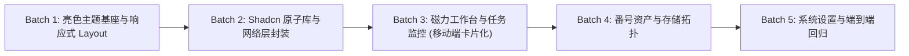

# Kuroko 前端完全重构与美术设计方案 (Frontend Revamp & Art Direction Plan)

> **文档版本**：v2.1.0（亮色优先与移动端响应式增强版）  
> **设计基调**：**亮色优先（Light-First）**，现代白瓷极简（Porcelain Tech）+ 完整暗色支持  
> **技术栈**：Vite + React 19 + TypeScript + Zustand + Shadcn/ui + Tailwind CSS (v4) + Axios  
> **核心目标**：针对实施 Agent 美术可能薄弱的问题，提供**保姆级、可直接套用的具象视觉规范与全端响应式布局指南**，杜绝粗糙低劣排版。

---

## 1. 为什么完全摒弃现有前端

现有前端存在以下结构性与视觉设计缺陷，局部修补的成本已高于推断重构：
1. **视觉简陋与缺乏专业设计语言**：原页面直接拼凑原生 textarea、普通纯色矩形，缺乏现代 Web 应用的调色板、空间韵律、微阴影与层次感。
2. **完全缺失移动端响应式适配**：页面在手机端大量元素被横向截断，表格超出屏幕无法阅读，输入框被软键盘遮挡，触控热区过小难以点击。
3. **缺失核心业务交互与微动效**：
   - 用户填入磁力链接时，**未能在前端即刻剔除冗余 BT Tracker 服务器**；
   - 磁力解析结果无法展开树形结构查看文件与过滤原因标签；
   - **缺失“被跳过任务”面板与一键“强制下载”通道**；
   - 存储空间没有直观的拓扑图与碎片优先（Best-Fit）推荐标记。
4. **组件抽象混乱**：未建立标准的 Shadcn/ui 原子体系，缺乏 Dialog、Sheet 抽屉、Dropdown、Toast 气泡通知等基础设施。

---

## 2. 美术设计方案 (Porcelain Tech 亮色优先视觉体系)

> [!IMPORTANT]
> **设计铁律（实施 Agent 必读）**：
> 系统**默认采用亮色模式（Light-First）**，呈现清爽、通透、高质感的科技白瓷风格，杜绝发灰、发脏或刺眼纯白。同时通过 CSS 变量保留一键切换深色模式的能力。

### 2.1 调色板与材质规范 (Color Tokens & Materials)

| 语义角色 | 亮色模式 (Default) | 深色模式 (Dark) | Tailwind 推荐类组合 | 视觉目的 |
| :--- | :--- | :--- | :--- | :--- |
| **应用底层背景** | `#f8fafc` (Slate-50) | `#090d14` (Deep Void) | `bg-slate-50 dark:bg-[#090d14]` | 极温和微冷灰，消除长时间注视疲劳 |
| **主要内容卡片** | `#ffffff` (Pure White) | `#111827` (Gray-900) | `bg-white dark:bg-slate-900` | 形成明晰的物理浮层 |
| **二级浮层/悬浮** | `#f1f5f9` (Slate-100) | `#1e293b` (Slate-800) | `bg-slate-100 dark:bg-slate-800` | 鼠标悬停、标签背景、输入框底色 |
| **边框与分割线** | `#e2e8f0` (Slate-200) | `#334155` (Slate-700) | `border-slate-200 dark:border-slate-800` | 细腻精巧的边界约束，禁止粗重边框 |
| **微阴影层次** | `0 1px 3px rgba(15,23,42,0.06)` | `0 1px 3px rgba(0,0,0,0.3)` | `shadow-sm shadow-slate-900/5` | 赋予卡片微妙的物理浮动质感 |
| **主品牌/高光色** | `#2563eb` (Blue-600) | `#38bdf8` (Sky-400) | `text-blue-600 dark:text-sky-400` | 科技感深蓝（亮）与极客冰蓝（暗） |
| **操作按钮强调** | `#2563eb` 悬停 `#1d4ed8` | `#0284c7` 悬停 `#0369a1` | `bg-blue-600 hover:bg-blue-700 text-white` | 高对比行动召唤按钮 |
| **成功 / 可下载** | `#059669` (Emerald-600) | `#34d399` (Emerald-400) | `bg-emerald-50 text-emerald-700 border-emerald-200` | 清爽健康绿，带轻量徽章底色 |
| **警告 / 已存跳过** | `#d97706` (Amber-600) | `#fbbf24` (Amber-400) | `bg-amber-50 text-amber-700 border-amber-200` | 温和琥珀金，提醒注意去重 |
| **错误 / 空间已满** | `#e11d48` (Rose-600) | `#f87171` (Red-400) | `bg-rose-50 text-rose-700 border-rose-200` | 警示珊瑚红，明确阻断 |
| **进行中 / 扫描中** | `#7c3aed` (Violet-600) | `#a78bfa` (Violet-400) | `bg-violet-50 text-violet-700 border-violet-200` | 电光紫，表现后台动态处理 |

### 2.2 文字排版规范 (Typography System)

1. **层级与字阶**：
   - **大屏主标题**：`text-xl sm:text-2xl font-bold text-slate-900 tracking-tight`
   - **卡片/分栏标题**：`text-base sm:text-lg font-semibold text-slate-800`
   - **正文常规文字**：`text-sm text-slate-600 leading-relaxed`
   - **辅助/时间/元信息**：`text-xs text-slate-400`
2. **专属等宽字体（实施 Agent 严禁忽略）**：
   - 对所有**番号（如 `MIDV-123`）**、**磁力哈希 (InfoHash)**、**文件物理路径**、**存储容量 (如 `4.28 GB`)**，一律应用等宽字体类：
   - `font-mono tracking-wide font-medium`（首选 `JetBrains Mono, Fira Code, monospace`）。
   - 效果：数字与字符严格等宽对齐，极大提升数据审计的专业度。

### 2.3 动态微交互体系 (Micro-interactions)

1. **即时磁力净化动效 (Live Magnet Cleaner)**：
   - 交互：用户将混合有大量 Tracker 的磁力链接粘贴入文本框；
   - 动效反馈：输入框右上角立即弹出一个微光 Badge：“⚡ 已自动清洗 12 个 Tracker，保留纯净 xt / dn”，并在 200ms 内平滑更新文本为规整的 `magnet:?xt=...&dn=...`；
   - 样式：`bg-emerald-100 text-emerald-800 text-xs px-2 py-0.5 rounded-full animate-in fade-in zoom-in-95 duration-200`。
2. **Best-Fit 碎片优先算法命中光效 (Best-Fit Light Beam)**：
   - 交互：提交任务时系统计算出最优剩余空间节点；
   - 视觉呈现：被选中的存储节点卡片增加一道淡蓝色微光呼吸描边 `ring-2 ring-blue-500/50 shadow-md shadow-blue-500/10`，并在右上角显示 `✨ 推荐存储 (碎片率最优)`。
3. **下载进度波纹与状态脉冲 (Pulse Progress)**：
   - 下载中的进度条具备动态斜向流动纹理（Stripe shimmer），状态胶囊带有柔和的点状呼吸呼吸灯：`<span className="h-2 w-2 rounded-full bg-blue-500 animate-ping" />`。

---

## 3. 全端响应式与移动端布局规范 (Mobile-First Architecture)

> [!IMPORTANT]
> **移动端必须达到的体验标准**：
> 1. **单手可操作性**：核心操作按钮位于屏幕下半区，点击目标尺寸不小于 `44px × 44px`。
> 2. **表格转卡片流（Table-to-Card Responsive Pattern）**：手机端（`max-md`）**严禁直接横向溢出滚动表格**，必须自适应转为垂直堆叠的信息卡片。
> 3. **无缝导航转换**：桌面端常驻左侧侧边栏，移动端自动转为顶部汉堡图标呼出的抽屉（Sheet）或底部快捷操作栏。

### 3.1 响应式断点体系

| 断点标识 | 视口范围 | 导航形式 | 布局组织 | 典型设备 |
| :--- | :--- | :--- | :--- | :--- |
| **Mobile (`default`)** | `< 640px` | 顶部极简 TopBar + Sheet 侧滑抽屉 / 底部 Tab 栏 | 单列卡片流，全宽输入，全屏抽屉弹窗 | iPhone, Android 主流手机 |
| **Tablet (`sm` ~ `md`)** | `640px ~ 1024px`| 紧凑折叠侧边栏 + 悬浮 TopBar | 双列栅格卡片，双栏工作台 | iPad, 折叠屏展开 |
| **Desktop (`lg` ~ `2xl`)**| `>= 1024px` | 左侧标准常驻侧边栏 (240px) | 宽屏多列面板、双栏联动工作台、大盘表格 | 桌面显示器、笔记本电脑 |

### 3.2 移动端各页面专属适配规范

#### 1. 框架布局 (AppLayout)
- **桌面端 (`lg:flex`)**：左侧固定宽度 `w-64 border-r border-slate-200 bg-white`，右侧主内容区 `flex-1 min-w-0 bg-slate-50 overflow-y-auto`；
- **移动端 (`lg:hidden`)**：
  - 顶部常驻极简导航条（高度 `h-14`，毛玻璃 `backdrop-blur-md bg-white/90 border-b border-slate-200/80 sticky top-0 z-40`）；
  - 左侧放置应用 Logo 与名称，右侧放置汉堡菜单图标（触控区 `p-2`，触发 Shadcn `Sheet` 抽屉从左侧滑出导航）；
  - 底部可选用底部导航栏（Bottom Navigation Bar）快速切换：磁力解析、任务监控、番号库、存储、设置。

#### 2. 磁力工作台 (MagnetParser) 移动端适配
- **输入区**：
  - 移动端文本框自适应最小高度 `min-h-[140px]`，字体 `text-base`（防止 iOS 输入时页面自动放大）；
  - 操作按钮组在移动端采用垂直全宽堆叠：`flex flex-col gap-2.5 sm:flex-row`，主按钮高 `h-12` 提升按压体验；
- **结果展现（卡片堆叠化）**：
  - 手机端放弃复杂的多列并排，采用单列满宽卡片 `w-full mb-3 p-4 rounded-xl bg-white border border-slate-200 shadow-sm`；
  - 展开文件树采用抽屉式（Drawer/Accordion）展开，避免撑破页面；
  - 强制下载按钮与跳过标识在卡片底部全宽横排，触控极其舒适。

#### 3. 任务监控 (Tasks) 移动端卡片化改造
- **桌面端**：展示宽幅表格（Table: 番号、磁力 Hash、状态、路径、速度、进度条、操作）；
- **移动端 (卡片降级范式)**：
  ```tsx
  // 移动端卡片视图范式
  <div className="md:hidden space-y-3">
    {tasks.map(task => (
      <div key={task.id} className="p-4 bg-white rounded-xl border border-slate-200 shadow-sm space-y-3">
        <div className="flex items-center justify-between">
          <span className="font-mono font-bold text-slate-900 text-base">{task.code}</span>
          <StatusBadge status={task.status} />
        </div>
        <div className="space-y-1">
          <div className="flex justify-between text-xs text-slate-500 font-mono">
            <span>{task.speed || '0 KB/s'}</span>
            <span>{task.progress.toFixed(1)}%</span>
          </div>
          <ProgressBar value={task.progress} />
        </div>
        <div className="text-xs text-slate-400 font-mono truncate">
          📁 {task.target_path}
        </div>
        <div className="flex justify-end gap-2 pt-1 border-t border-slate-100">
          <Button size="sm" variant="outline">重试</Button>
          <Button size="sm" variant="ghost" className="text-rose-600">取消</Button>
        </div>
      </div>
    ))}
  </div>
  ```

#### 4. 番号资产库 (Codes) 移动端适配
- 顶部搜索框在移动端占满屏幕宽度，右侧放置“筛选”浮层按钮；
- 探测扫描悬浮进度条以浮动底栏（Bottom Sheet Toast）方式呈现，不遮挡正在浏览的番号卡片；
- 番号卡片采用自适应双列网格（`grid grid-cols-2 gap-2.5 sm:grid-cols-3 md:grid-cols-4 lg:grid-cols-6`）。

#### 5. 存储编排 (Storages) 移动端适配
- 各存储分组与挂载点在移动端单列排列，空间利用条加粗至 `h-3`，直观显示已用百分比；
- 手动容量配置弹窗在手机端自动转为底部弹出的抽屉（Bottom Drawer）。

---

## 4. 前端组件与目录架构

```text
frontend/src/
├── app/                      # 路由与鉴权
│   ├── router.tsx            # 声明式路由定义
│   └── guards/               # 认证守卫 (RequireAuth, RequireInit)
├── assets/                   # Logo 与插画
├── components/
│   ├── ui/                   # 纯净 Shadcn/ui 原子组件 (统一遵循亮色默认样式)
│   │   ├── button.tsx, badge.tsx, card.tsx, dialog.tsx, sheet.tsx, drawer.tsx,
│   │   ├── input.tsx, label.tsx, progress.tsx, table.tsx, tabs.tsx, tooltip.tsx
│   ├── common/               # 通用业务复合组件
│   │   ├── PageHeader.tsx    # 自适应标题区与面包屑 (移动端紧凑排布)
│   │   ├── StatCard.tsx      # 亮色指标卡片 (带浅蓝微阴影)
│   │   ├── EmptyState.tsx    # 空状态插画与引导
│   │   ├── ResponsiveTable.tsx # 响应式智能表格 (桌面表格，移动端自适应转卡片)
│   │   └── FileTree.tsx      # 树状展开文件列表
│   ├── layout/               # 布局与导航
│   │   ├── AppLayout.tsx     # 响应式骨架容器
│   │   ├── AppSidebar.tsx    # 桌面端侧边栏
│   │   ├── MobileTopNav.tsx  # 移动端顶部导航 (带汉堡菜单)
│   │   ├── MobileBottomNav.tsx # 移动端底部快捷导航条
│   │   └── ThemeToggle.tsx   # 亮/暗模式切换器 (默认 Light)
│   └── features/             # 核心领域特性组件
│       ├── magnet/           # 磁力即时清洗器、两阶段复核卡片、跳过/强制下载面板
│       ├── task/             # 任务进度卡片、轮询监控表、操作控制组
│       ├── code/             # 番号网格流、定向扫描抽屉、快速检索过滤条
│       ├── storage/          # 存储碎片仪表盘、Best-Fit 算法命中指示、容量手动设置
│       └── settings/         # OpenList 设置卡片、magnet-metadata-api 设置、规则 Tags 编辑
├── hooks/                    # 业务 Custom Hooks
│   ├── useMagnetCleaner.ts   # 磁力链接输入即刻清洗与防抖提取
│   ├── useTaskPolling.ts     # 10秒增量任务轮询
│   └── useMediaQuery.ts      # 移动端断点动态监听 (`isMobile`, `isTablet`)
├── stores/                   # Zustand 状态切片 (authStore, uiStore, configStore)
├── services/                 # Axios 领域 API 客户端
├── types/                    # 严格数据契约
├── styles/                   # 样式体系
│   └── globals.css           # 亮色优先 CSS 变量与 Tailwind v4 规则
└── lib/                      # 工具类 (formatters, magnetCleaner, cn)
```

---

## 5. 实施与分 Batch 交付里程碑



### Batch 1：亮色主题基座与移动端响应式 Layout
- 清空旧前端混乱文件，配置 Tailwind CSS v4 默认**亮色优先（Porcelain Tech）**调色板；
- 实现响应式应用骨架：桌面端 `AppSidebar` 与移动端 `MobileTopNav` + `Sheet` 抽屉导航；
- 引入等宽字体配置与移动端视口防缩放处理。

### Batch 2：Shadcn UI 原子组件库与强化网络层
- 建立纯净可复用的 Shadcn/ui 原子组件库，确保按钮具备最小 `44px` 移动端触控热区；
- 封装 Axios Client：自动注入 JWT、401 隔离跳转、统一错误提示 Toast、AbortController 取消信号管理；
- 实现 `useMediaQuery` 响应式状态监听。

### Batch 3：磁力工作台与任务监控（全端适配）
- 实现 `MagnetCleanerInput`：前端粘贴即时清洗多余 Tracker，展示微光 Badge；
- 实现两阶段番号复核卡片与文件过滤树；
- 实现已存在拦截、跳过列表与一键强制下载（`force: true`）交互；
- 实现任务监控：桌面宽幅表格，移动端自动降级为优雅卡片流，每 10 秒增量平滑轮询。

### Batch 4：番号资产中心与存储拓扑编排
- 实现番号资产流（自适应网格 + 模糊搜索 + 来源筛选）；
- 实现定向探测扫描控制抽屉与实时进度提示；
- 实现存储拓扑图、Best-Fit 碎片优先高光标记与移动端容量配置抽屉。

### Batch 5：系统设置中枢、全局联调与测试验证
- 实现 OpenList 连通性测试卡片（保护用户现有真实配置，严禁覆盖）；
- 实现 `magnet-metadata-api` 配置卡片与连通性测试；
- 全端响应式走查：在 PC 宽屏、iPad 平板与手机端（375px/390px/412px）完整验证布局与交互体验；
- 质量门禁验证：`pnpm lint`、`tsc -b`、`pnpm test`、`pnpm build`。
