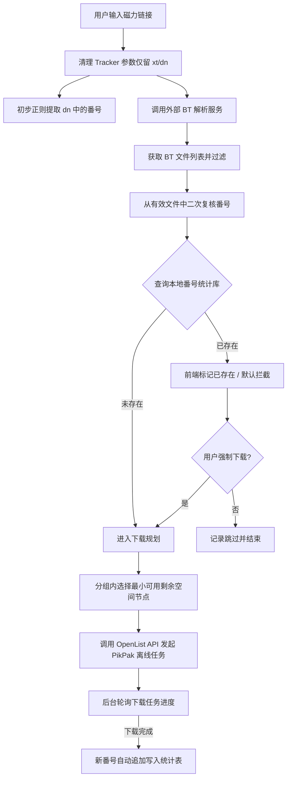

# Kuroko 需求文档

| 文档版本 | 状态 | 编写日期 | 适用系统版本 |
| :--- | :--- | :--- | :--- |
| v1.0.0 | 正式发布 | 2026-09-06 | Kuroko v1.0+ |

---

## 1. 项目概述

### 1.1 项目定位
Kuroko 是一个专为影视番号管理与自动化离线下载设计的轻量化管理系统，基于 **OpenList API**（Alist 分支）生态构建。系统以磁力链接为输入，深度整合外部 BT 解析能力与 OpenList 网盘聚合能力，实现从磁力清洗、番号提取、存量去重、智能碎片空间匹配，到调用 PikPak 发起离线下载与全链路进度跟踪的闭环处理。

### 1.2 核心价值
- **自动化清洗与精准识别**：自动剔除冗余 BT Tracker，两阶段复核（`dn` 参数初筛 + BT 文件树深层识别）番号，准确率高。
- **智能化去重与多版本支持**：自动对比 OpenList 现有媒体库，避免重复下载浪费资源，同时保留人工「强制下载」通道支持字幕版、高清重置版下载。
- **碎片空间优先算法**：针对多个分散挂载的云存储节点，采用「满足容量前提下的最小剩余优先」策略，充分榨干各网盘存储碎片。
- **轻量定向探测**：仅扫描配置的探测子路径，结合下载后自动入库机制，极大降低全库遍历带来的 API 频控风控和性能损耗。

### 1.3 核心业务流程

---

## 2. 功能需求

### FR-01 认证系统
- **FR-01-1 系统访问保护**：Kuroko 系统除登录接口外，所有 REST API 与管理页面均需受 JWT（JSON Web Token）认证机制保护。
- **FR-01-2 账号认证**：支持基于预设/配置的用户名与密码进行身份认证。首次登录或密码验证通过后下发短期有效 Token 与可选的刷新机制。
- **FR-01-3 鉴权拦截**：未携带有效 `Authorization: Bearer <token>` 或 Token 过期失效的请求统一返回 `401 Unauthorized`，前端自动拦截并重定向至登录页。

### FR-02 磁力链接解析
- **FR-02-1 参数清洗**：输入磁力链接（`magnet:?xt=...`）后，自动化清理冗余的 `tr` (Tracker) 及统计参数，严格仅保留 `xt`（文件特征码哈希）和 `dn`（显示名称）参数，保持下载标识唯一且规范。
- **FR-02-2 初步番号提取**：基于 `dn` 参数通过通用正则模式（如 `[A-Za-z]{2,5}-\d{3,5}`、`T28-\d{3}` 等主流规则）提取候选番号。
- **FR-02-3 外部 BT 解析**：
  - 支持配置外部 BT 解析服务地址（由用户自行部署或提供第三方兼容接口）。
  - 通过 POST/GET 携带清洗后的磁力链接请求解析服务，异步/同步获取该 Torrent/磁力内部的完整文件列表（包括各文件的相对路径、文件名、字节大小）。
- **FR-02-4 文件名复核提取**：遍历解析出的文件列表，针对实际多媒体文件名进行二次正则复核与修正，确保最终提取的番号与实际媒体内容一致。
- **FR-02-5 文件过滤管道**：对解析出的文件列表应用三重过滤规则：
  1. **后缀名白名单**：可配置，默认包含常见多媒体格式（如 `.mp4`, `.mkv`, `.avi`, `.ts`, `.wmv`）。
  2. **文件大小下限**：可配置，默认阈值为 `100MB`，自动剔除小样本、宣传片、垃圾文件。
  3. **正则黑名单**：可配置正则表达式，针对常见广告词、发布组水印命名、无意义文本文件进行屏蔽过滤。
- **FR-02-6 过滤结果呈现**：未命中有用规则的垃圾文件默认从候选列表中丢弃，前端默认仅高亮展示有效视频文件。

### FR-03 番号去重
- **FR-03-1 库内比对**：将提取出的标准番号与系统维护的 OpenList 番号数据库进行快速精确查找。
- **FR-03-2 拦截与标记**：若番号已存在于库中，系统默认将该任务标记为「已存在」，并在批量添加/单任务添加队列中默认禁止加入离线下载队列。
- **FR-03-3 强制下载覆盖**：针对特异化场景（如已下载版本为无字幕版、画质较差版本，当前磁力为中字或 4K 高码版本），前端提供「强制下载」操作按钮，允许用户显式绕过去重校验执行下载。
- **FR-03-4 跳过记录与可视化**：因重复而被跳过的磁力链接需保留在本次会话/历史记录面板中，明确标记跳过原因，方便用户审计与核对。

### FR-04 OpenList 文件获取与空间统计
- **FR-04-1 接口通信**：通过 OpenList 提供的标准文件系统接口（如 `/api/fs/list`）获取指定挂载存储和目录下的文件结构与属性元数据。
- **FR-04-2 剩余空间感知**：
  - 调用 OpenList 存储接口获取各存储源的物理/配额剩余空间。
  - **自动模式**：若 OpenList 驱动接口能原生返回当前存储库的剩余空间（`free_size`），系统直接读取采用。
  - **手动补偿模式**：若挂载源（如部分特定的网盘或 WebDAV）未返回剩余空间，支持用户在前端管理后台手动标记该存储库的总空间容量（Quota）。系统通过递归统计库内已有文件的累计体积，以 `总容量 - 已用容量` 动态推算剩余空间。
- **FR-04-3 分库统计视图**：前端以存储库为单位展示存储拓扑，清晰呈现各库的总容量、已用空间、剩余空间百分比及预警状态。

### FR-05 离线下载
- **FR-05-1 接口调用**：通过 OpenList 官方 `/api/fs/add_offline_download` 接口投递下载任务。
- **FR-05-2 离线引擎与策略绑定**：
  - 下载工具固定指定为 `PikPak`（`tool: "pikpak"`）。
  - 下载完成后的删除策略固定为「总是删除」（`delete_policy: "always"`），即离线成功转存至目标存储后，自动清理 PikPak 云端缓存，节约空间。
- **FR-05-3 落地目录反馈**：任务发起成功后，系统即时记录并向前端与日志反馈最终规划的目标落地路径（如：`OD-Group1/NodeA/Video/ABC-123/`）。

### FR-06 智能下载位置规划
- **FR-06-1 存储分组模型**：支持多存储节点分组管理机制。一个存储分组（Storage Group）下可纳管多个 OpenList 挂载节点（Storage Node）。
- **FR-06-2 碎片空间优先算法（Best-Fit Minimal Remainder）**：
  - 用户提交下载请求并指定目标分组后，系统计算该磁力待下载有效文件的总尺寸。
  - 在候选分组的所有可用存储节点中，筛选出 `剩余空间 >= 待下载文件大小` 的可用节点集合。
  - **排序策略**：在上述可用节点中，优先选择**剩余空间最小**的节点作为下载目标。通过优先填满容量较小的剩余空隙，最大限度减少存储碎片。
- **FR-06-3 自动顺延机制**：若剩余空间最小的节点空间不足以完全容纳当前任务，则顺延至集合中下一个较小的可用节点；若分组内所有节点均无法容纳，阻断下载并报警提示。
- **FR-06-4 满载状态流转**：当存储节点剩余空间低于预设安全阈值（或不足以承载一般多媒体文件）时，节点在调度拓扑中被标记为「已满」，不再分配新任务。
- **FR-06-5 规划结果追踪**：下载任务创建时明确固化入库目标路径，并在任务列表全过程展示。

### FR-07 下载进度同步
- **FR-07-1 定时状态轮询**：后台启动异步定时调度任务，轮询 OpenList 离线任务列表 API，增量拉取任务最新状态。
- **FR-07-2 状态模型映射**：将 OpenList 底层状态统一归一化为四类生命周期：
  - `pending`（等待中）
  - `downloading`（下载中）
  - `completed`（已完成）
  - `failed`（失败）
- **FR-07-3 动态指标展示**：前端提供实时任务进度面板，展示下载百分比进度条、传输速率（若接口支持）、当前阶段提示及异常错误原因。

### FR-08 番号统计与库管理
- **FR-08-1 定向探测路径配置**：
  - 支持配置「探测路径」（Probe Path），每个探测路径精准绑定特定存储库的具体子目录。
  - *示例*：针对存储库 `OD-01` 仅配置 `/Video1`、`/Video2`；针对存储库 `OD-02` 仅配置 `/Media/Pool`。
- **FR-08-2 极速扫描与频控保护**：严格限制扫描范围仅在配置的探测子目录内，禁止执行根目录全库递归深度遍历，极大降低 API 调用量，防止触发网盘或 Alist 上游限流。
- **FR-08-3 规则一致性过滤**：扫描过程同样复用文件扩展名、最小体积、广告正则黑名单规则，过滤无效内容。
- **FR-08-4 元数据持久化**：从扫描过滤后的合规文件中解析番号，建立并持久化「番号统计表」（包含番号、文件路径、文件大小、所属存储节点、收录时间等）。
- **FR-08-5 离线成功自动增量入库**：当通过 Kuroko 发起的离线下载任务完成确认后，系统直接从任务元数据中将新番号追加写入番号统计库，**无需触发全量扫库**，保证数据实时性与系统开销最小化。

### FR-09 前端在线配置
- **FR-09-1 统一配置中枢**：支持通过 Web 前端可视化界面管理系统全部核心配置项，配置修改即时热生效或优雅重启生效：
  - **OpenList 连接设置**：服务 Base URL、认证凭证（用户名/密码 或 直连 API Token）。
  - **内容过滤规则**：文件扩展名白名单（Tag 形式增删）、最小文件大小（MB）、广告/无效文件名正则表达式黑名单。
  - **存储分组与节点**：创建与编辑分组，增删分组所属的存储节点及其根路径。
  - **探测路径管理**：可视化选择或填报定向扫描的存储库路径。
  - **容量标记覆盖**：针对无原生空间查询的存储源，手动填报总容量上限。
  - **外部解析设置**：配置外部 BT 解析服务的完整 API 路由与鉴权密钥（如有）。

### FR-10 GitHub Actions CI/CD
- **FR-10-1 Tag 自动触发**：支持基于 Git Tag 推送事件（如 `v*.*.*`）自动触发 CI/CD 工作流。
- **FR-10-2 镜像自动构建与发布**：
  - 工作流内自动执行环境校验、依赖构建。
  - 构建多架构/生产级 Docker 镜像，并自动推送至 **GitHub Container Registry (GHCR)**（`ghcr.io/<owner>/kuroko`）。
  - 自动打上版本 Tag（如 `v1.0.0`）及 `latest` 标签。

### FR-11 Docker 部署
- **FR-11-1 单镜像容器化交付**：前端构建产物并入后端，由 FastAPI 统一提供静态文件和 API 服务，以 `python -m app.serve` 为容器启动入口，项目根目录提供 `docker-compose.yml`。
- **FR-11-2 GHCR 镜像集成**：预制镜像配置默认指向 GitHub Actions 构建产出的官方 GHCR 镜像（`ghcr.io/<owner>/kuroko`）。
- **FR-11-3 端口与环境解耦**：
  - 服务监听端口支持通过环境变量（`.env`）灵活指定（默认 `8000`）。
  - 持久化与日志目录（`config/`、`data/`、`logs/`）独立挂载，保证容器升级配置与数据不丢失。

---

## 3. 非功能性需求

### NFR-01 安全性（Security）
- **NFR-01-1 JWT 鉴权保护**：用户认证采用安全签名算法的 JWT Token，签名秘钥必须支持自定义环境变量注入，杜绝默认弱口令。
- **NFR-01-2 敏感凭据脱敏**：OpenList 密码、Token、BT 解析服务密钥等敏感信息在日志输出、前端展示脱敏回显时进行掩码处理（如 `sk-****`），禁止明文落盘日志。
- **NFR-01-3 强类型输入校验**：后端所有外部输入（磁力链接、配置表单、分页参数等）必须通过 Pydantic 模型严格校验类型、长度和格式，防范正则表达式拒绝服务（ReDoS）及注入攻击。

### NFR-02 可维护性与工程规范（Maintainability）
- **NFR-02-1 架构清晰解耦**：遵循前后端完全分离架构。后端采用分层架构（API 控制器、业务服务 Service、数据模型 Model、统一 Schema、底层 Util 工具库）；前端遵循模块化组织。
- **NFR-02-2 中文注释覆盖**：所有涉及去重逻辑、碎片优先算法、番号正则解析、多源空间计算等复杂核心业务逻辑处，必须附带清晰的简体中文注释，重点说明“为什么这样设计”。
- **NFR-02-3 完善的工程文档**：提供完备的设计文档、架构图、环境配置模板（`.env.example`）及快速上手指南。

### NFR-03 可部署性（Deployability）
- **NFR-03-1 开箱即用**：提供标准 `docker-compose.yml`，用户仅需执行 `docker compose up -d` 即可拉起全套服务。
- **NFR-03-2 首次启动引导**：当检测到数据库为空或未配置任何 OpenList 节点时，前端友好引导用户进入快速初始化配置向导，避免直接报错或空白页面。

---

## 4. 技术栈选型

| 领域 | 选型组件 | 说明 / 选型理由 |
| :--- | :--- | :--- |
| **后端语言与运行时** | Python 3.12+ | 利用现代 Python 类型提示与高性能异步特性 |
| **Web 框架** | FastAPI | 高性能异步 REST API，内置 Swagger/OpenAPI 规范，强类型支持 |
| **ORM & 数据模型** | SQLAlchemy 2.0+ & Pydantic v2 | 现代异步/同步兼备的 ORM 与高性能数据校验解析 |
| **ASGI 服务器** | Uvicorn | 生产级轻量快速的 ASGI 服务器 |
| **前端框架** | React 19 & TypeScript | 强类型组件化开发，兼具生态与长期演进保障 |
| **前端构建工具** | Vite | 极速的热重载开发体验与高效的生产打包 |
| **前端包管理器** | pnpm 10+ | 高效硬链接依赖存储与严格依赖隔离，避免幽灵依赖 |
| **UI 组件库** | Shadcn/ui & Tailwind CSS | 高质量、高定制性无障碍组件库，代码可控度高 |
| **状态管理** | Zustand | 轻量、简洁且无样板代码的客户端全局状态管理 |
| **数据同步/缓存** | TanStack Query (React Query) | 优雅处理服务端状态缓存、轮询、重试与网络请求抽象 |
| **数据库** | SQLite | 嵌入式单文件数据库，无须额外维护数据库守护进程，非常适合轻量自建部署 |
| **项目构建** | Make (Makefile) | 统一本地构建、开发、测试、镜像打包的命令行操作入口 |
| **容器编排** | Docker & Docker Compose | 屏蔽运行环境差异，标准化容器交付 |
| **CI/CD** | GitHub Actions | 自动化代码检查、镜像构建及 GHCR 发布流水线 |

---

## 5. 外部依赖与集成说明

### 5.1 OpenList API
- **服务定位**：底层核心依托系统，负责聚合网盘管理与离线任务中转驱动。
- **核心交互接口**：
  - `/api/auth/login` 或基于预置 Token 的鉴权通信。
  - `/api/fs/list`：查询目录结构、文件列表、文件大小及元数据。
  - `/api/fs/add_offline_download`：发起离线下载任务（固定参数：`tool: "pikpak"`, `delete_policy: "always"`）。
  - 任务状态查询接口：定时同步离线任务进度。
  - 存储信息接口：获取各存储驱动的容量与可用空间。

### 5.2 外部 BT 解析服务
- **服务定位**：将用户输入的磁力链接或种子文件在云端或远端快速解析，在不实际下载全量视频的情况下获取内部文件树结构。
- **协议要求**：
  - 支持向指定端点提交 `magnet` 链接字符串。
  - 返回统一的 JSON 格式结构，包含：种子名称、总大小、包含的文件子列表（含相对路径、文件名、字节尺寸）。
  - 可由用户在 Kuroko 统一配置面板中自由定义后端请求地址。
